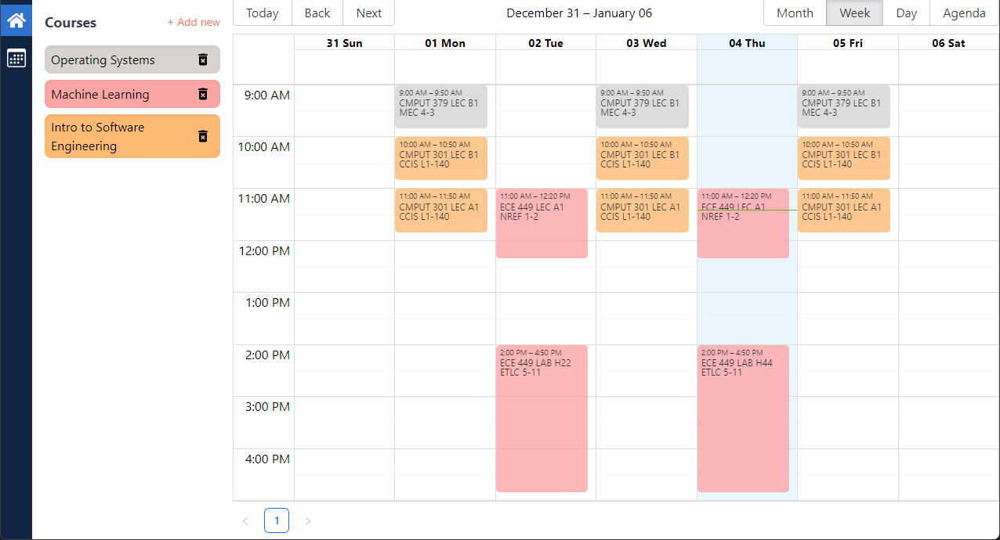
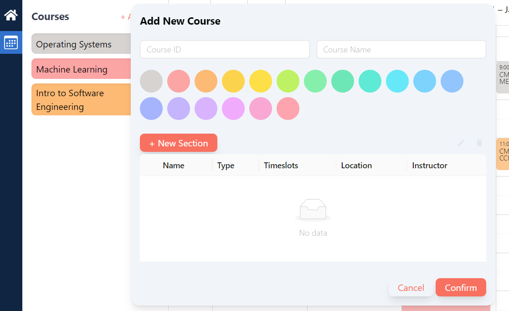
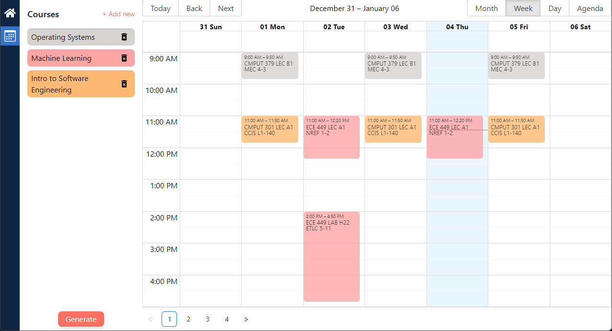
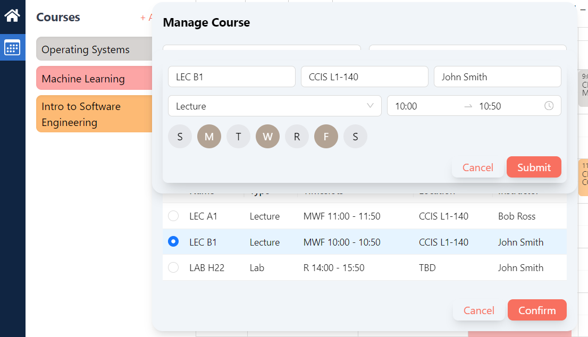

# Smart Course Planner

## Introduction

Welcome to the Smart Course Planner App, a comprehensive and user-friendly tool designed to streamline the process of organizing and visualizing academic schedules. This application is the perfect companion for students and educators alike, aiming to simplify the task of course planning with an intuitive and visually appealing interface.

## Features

### 1. Course Addition and Calendar Visualization

- **Interactive Calendar View**: Plan your academic term with ease. Add courses to your schedule and see them neatly displayed in a dynamic calendar view. This feature helps you visualize your weekly class timetable at a glance.
  
  
### 2. Color-Coded Courses

- **Customizable Color Coding**: Assign distinct colors to different courses for enhanced visual organization. This feature allows users to quickly identify courses on their schedule, facilitating a more efficient planning process.
  

### 3. Automated Schedule Generation

- **Smart Schedule Generator**: The built-in algorithm generates all possible course schedules based on the courses and preferences you input. This powerful tool takes the guesswork out of finding the best possible class timetable to suit your needs.
  

### 4. Detailed Course Configuration

- **Flexible Course Settings**: Tailor each course to fit your specific requirements. Set course names, sections, timeslots, and more. The app provides the flexibility to adjust course details, ensuring your schedule accurately reflects your academic plan.
  
  

## Getting Started

1. **Installation**: Clone the repository and follow the instructions in the /api and /web folders to run the application.
2. **Adding Courses**: Navigate to the course addition section and input your course details.
3. **Customize Your View**: Choose colors for each course and watch your calendar come to life with a burst of color.
4. **Generate Your Schedule**: Use the schedule generator to explore different timetable configurations and select the one that best fits your academic and personal life.

## Technologies Used

- Front-end: React, TypeScript, Tailwind CSS
- Back-end: C++, cpprestdsk
- State Management: Redux
- Additional Libraries: React Big Calendar, Ant Design

**Smart Course Planner** - Plan smarter, not harder! 📚✨